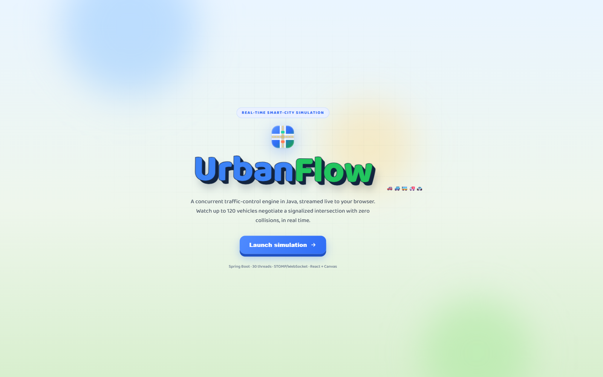
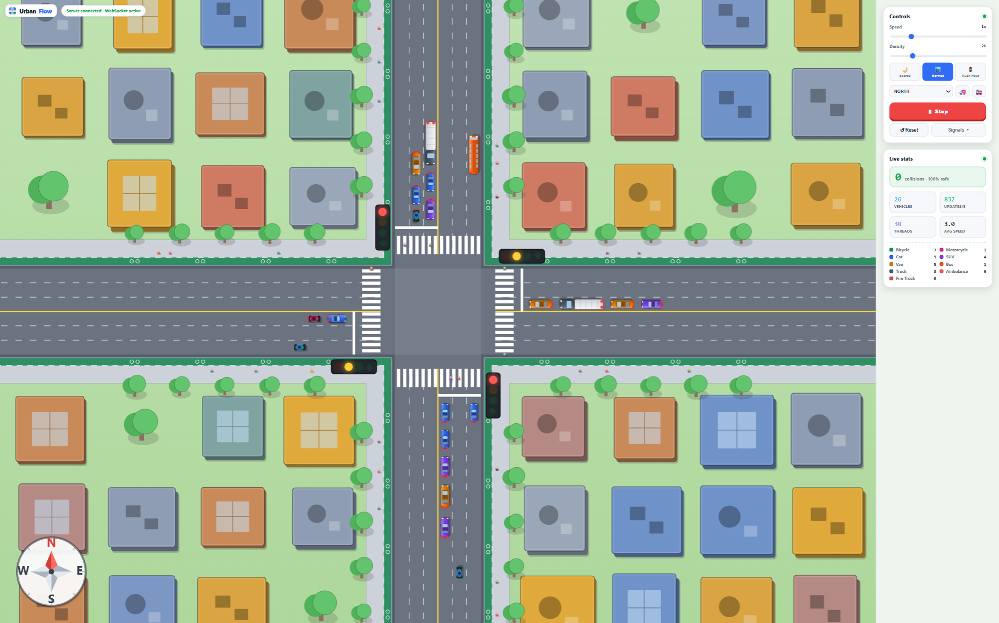
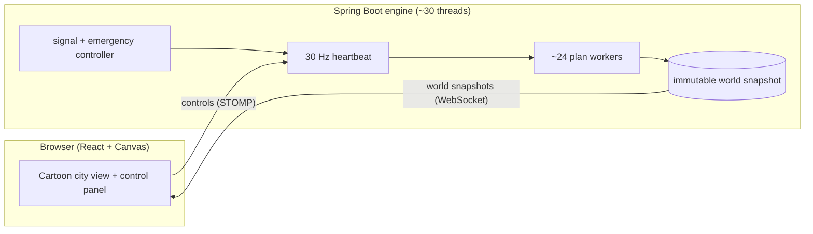
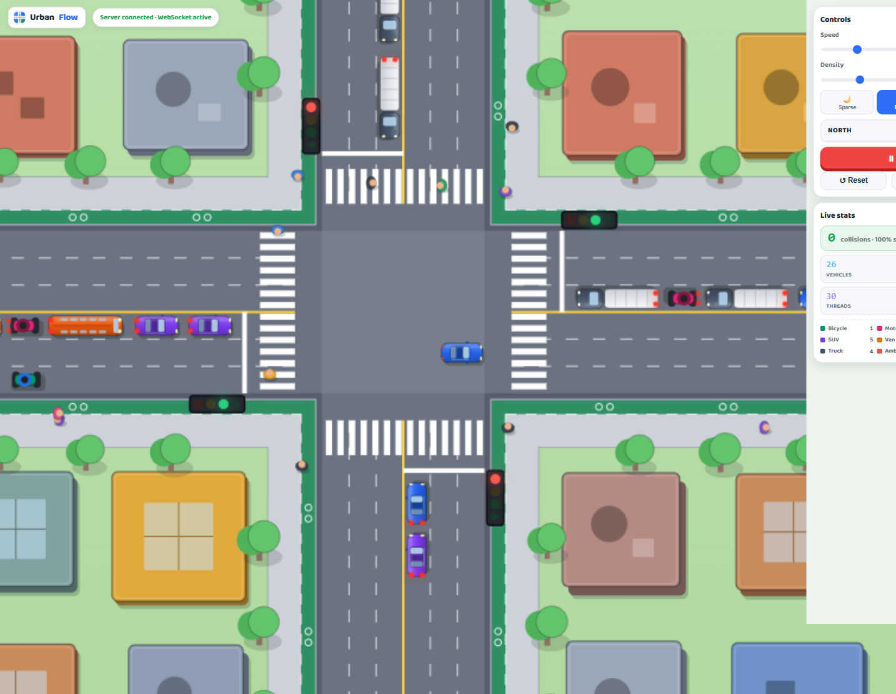

<div align="center">



<h1>UrbanFlow</h1>

<b>120 cars through one intersection, in real time, with zero collisions.</b><br>
A concurrent traffic-control engine in Java, streamed live to a React + Canvas city in the browser.

<br><br>


</div>

<p align="center">
  
</p>

## What it is

UrbanFlow is a real-time simulation of a busy signalized intersection. Every vehicle on screen is an independent agent making its own decisions many times a second. A Java engine runs the whole world across roughly thirty threads and streams it to the browser over WebSocket, where a React app draws it as a hand-illustrated cartoon city. Up to **120 cars**, buses, vans and ambulances move through the crossing at the same time, and a runtime checker proves they never collide.

I built it to learn real-time concurrent systems by watching them work, not by reading about them.

## What this project demonstrates

If you are skimming, here is the engineering on display:

- **Concurrency without locks.** Around thirty threads read the same world at once with no contention, because they all read from one immutable snapshot while a single writer prepares the next one. No shared mutable state, no deadlocks, no torn reads.
- **Real-time systems.** A fixed 30 Hz simulation loop drives the engine, and world snapshots are streamed to the browser over STOMP/WebSocket, interpolated for smooth motion between frames.
- **Correctness under load.** Safety is enforced by construction (following gaps, signal phasing, "don't block the box," emergency preemption) and verified by an invariant checker that runs every tick. The result holds at full density: zero collisions.
- **Full-stack engineering.** A Spring Boot backend (the simulation and the wire protocol) paired with a TypeScript + React + Canvas frontend (rendering, interpolation, live controls) drawn entirely in vector, no sprites.
- **Clean systems design.** Three small patterns carry the whole thing: an immutable snapshot that is swapped atomically, a command mailbox so the UI never touches engine state directly, and a heartbeat loop that decouples simulation rate from render rate.

## Run it locally

You need **Java 17**, **Maven**, and **Node 18+**. Open two terminals.

**1. Backend** (the Java simulation engine, serves a WebSocket on port 8080):

```bash
cd backend
mvn spring-boot:run
```

**2. Frontend** (React + Canvas, talks to the backend over WebSocket):

```bash
cd frontend
npm install
npm run dev
```

Open the URL Vite prints (usually `http://localhost:5173`) and press **Launch simulation**. Start the backend first, then the frontend.

> The control panel on the right lets you change traffic density live (up to 120 vehicles), retime the signals, and dispatch an ambulance or fire truck that flips the lights in its favour.

## The hard part: a hundred cars all thinking at once

The whole point was traffic where every car thinks for itself, all together, all the time. That sounds simple until you try it: when a hundred little "minds" reach for the same shared world at the same instant, the data normally corrupts or the program freezes.

The idea that made it click was surprisingly calm:

> Everyone reads from the same frozen **photo** of the world. Then a single referee writes the **next** photo. Nobody ever scribbles on the same page at the same time.

So roughly thirty workers can all look at the road at once (a photo can't change while you read it), and only one of them is ever allowed to paint the next moment. With that one rule in place, the simulation never trips over itself and never locks up. The fix for chaos was not more locks and guards, it was giving everyone something that cannot change underneath them.

## How it fits together



- **The shared photo** - one snapshot of the world that everybody reads from, swapped out all at once. This is what keeps the crowd of workers from fighting.
- **The mailbox** - when you drag a slider or send an ambulance, it doesn't reach into the engine. It drops a note in a box, and the engine reads its mail when it is ready.
- **The heartbeat** - the world ticks about thirty times a second, like a game loop, so motion looks smooth even though the data arrives in little bursts.

## Zero collisions, by construction

To get to zero crashes, the cars follow the same etiquette we all learned for the road, written down as code:

- **Keep your distance.** Every vehicle watches the one ahead and leaves a real gap, easing off the gas as it closes in.
- **Green means the whole path is yours.** The lights are timed so streams that get a green never cross. Left turns get their own moment, with a yellow and an all-red pause between phases.
- **Never block the box.** A car only enters the middle if it can make it all the way out, which makes gridlock impossible.
- **A red light is a wall.** Cars stop cleanly at the line and wait their turn.
- **Make way for sirens.** An ambulance or fire truck flips the lights in its favour and everyone yields.

A watcher checks the whole road on every heartbeat and confirms no two vehicles ever overlap. The zero you see on screen is not a hope, it is verified thousands of times a second.

<p align="center">
  
</p>

## A living city

Nine kinds of vehicle, from a bicycle up to a fire truck, each with its own size and feel: a bus is heavy and slow off the line, a motorbike is nimble, and nothing ever spills over its lane lines. When a car slows and stops, its brake lights glow red, so a queue waiting at a light reads as patient rather than frozen. Around the crossing sits a small hand-drawn city: dense blocks of towers, footpaths, protected bike lanes, street trees, and people who walk from door to door and cross only at the crosswalks when their light turns.

## Tech stack

| Layer | What it uses |
|------|---------------|
| Engine | Java 17, Spring Boot 3.2, a fixed-rate scheduler and an immutable snapshot model |
| Transport | STOMP over WebSocket (SockJS fallback) |
| Frontend | React 19, TypeScript, Vite, hand-drawn HTML Canvas rendering |
| Tooling | Maven (backend), npm + Vite (frontend) |

<div align="center">
<br>
Built for the love of watching systems work.<br>
<sub>Java for the brain, React + Canvas for the window, streamed live over WebSocket.</sub>
</div>
