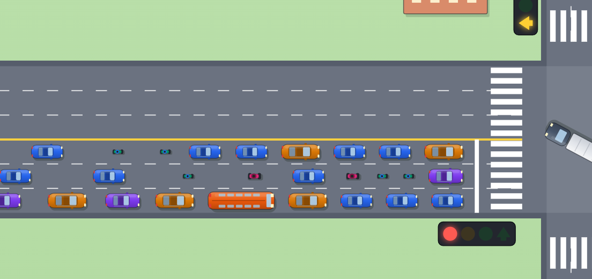
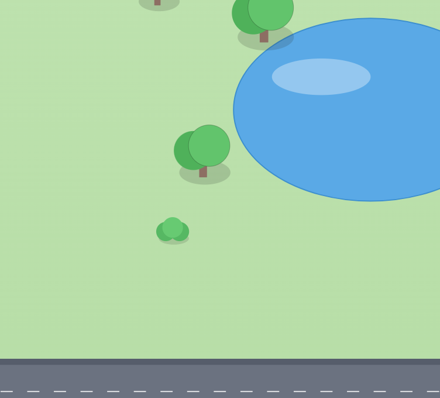

  

<h1 align="center">UrbanFlow</h1>

  <b>A tiny city intersection that comes alive in your browser.</b> 
  Up to 120 cars, buses, vans and ambulances pour through one crossing in real time - and never crash.

  <code>120 vehicles</code> &nbsp;·&nbsp; <code>9 kinds</code> &nbsp;·&nbsp; <code>24 lanes</code> &nbsp;·&nbsp; <code>30 threads</code> &nbsp;·&nbsp; <code>~3,900 updates a second</code> &nbsp;·&nbsp; <code>0 collisions</code>

 

This is a little world I built to teach myself a few hard things by watching them happen, not by reading about them. Every dot on the road is a vehicle making its own decisions, all at the same time, many times a second. Below is what I actually learned along the way.

---

## Doing a hundred things at once (without it falling apart)

The whole point was traffic where every car thinks for itself, all together, all the time. That sounds simple until you try it: when a hundred little "minds" reach for the same shared world at the same instant, things normally corrupt or freeze.

The idea that made it click for me was surprisingly calm:

> Everyone reads from the same frozen **photo** of the world. Then a single referee writes the **next** photo. Nobody ever scribbles on the same page at the same time.

So roughly thirty workers can all look at the road at once (because a photo can't change while you read it), and only one of them is ever allowed to paint the next moment. With that one rule in place, the simulation never trips over itself and never locks up. That was the big lesson: the fix for chaos was not more locks and guards, it was giving everyone something that can't change underneath them.

  

---

## The design

I wanted it to feel like a friendly control room, not a spreadsheet. A bright, top-down cartoon town on the left, a calm panel of controls and live numbers on the right, and a little compass tucked in the corner so you always know which way is North.

  

A few **design patterns** I picked up, in plain words:

- **The shared photo** - one snapshot of the world that everybody reads from, swapped out all at once. (This is what keeps the crowd of workers from fighting.)
- **The mailbox** - when you drag a slider or send an ambulance, it doesn't reach into the engine. It drops a note in a box, and the engine reads its mail when it's ready.
- **The heartbeat** - the world ticks about thirty times a second, like a game loop, so motion looks smooth even though the data arrives in little bursts.

The nicest surprise was how much of "good design" turned out to be about *who is allowed to touch what, and when*.

---

## The rules that keep everyone safe

To get to **zero crashes**, I had to teach the cars the same rules we all learned for the road. Writing them down as code made me realize how much careful etiquette is hidden in an ordinary intersection:

- **Keep your distance.** Every vehicle watches the one ahead and leaves a real gap, easing off the gas as it closes in.
- **Green means the whole path is yours.** The lights are timed so the streams that get a green never cross each other - left turns get their own moment, with a yellow and an all-red pause in between.
- **Never block the box.** A car only enters the middle if it can make it all the way out. That single rule makes gridlock impossible.
- **A red light is a wall.** Cars stop cleanly at the line and wait their turn.
- **Make way for sirens.** An ambulance or fire truck flips the lights in its favour and everyone yields.

A watcher checks the whole road on every single heartbeat and confirms no two vehicles ever overlap. The `0 collisions` you see on screen isn't a hope - it's checked thousands of times a second.

---

## A little living world

Nine kinds of vehicle, each drawn at its real size, from a bicycle up to a fire truck. They were the most fun part: getting a bus to feel heavy and a motorbike to feel nimble, and making sure nothing ever spills over its lane lines.

  

And because an empty grid is lonely, the town got trees, a pond, flowerbeds and little houses around the edges - a calm green backdrop for all the rushing.

  

---

  Built for the love of watching systems work. 
  Java for the brain · React + Canvas for the window · streamed live over WebSocket.

