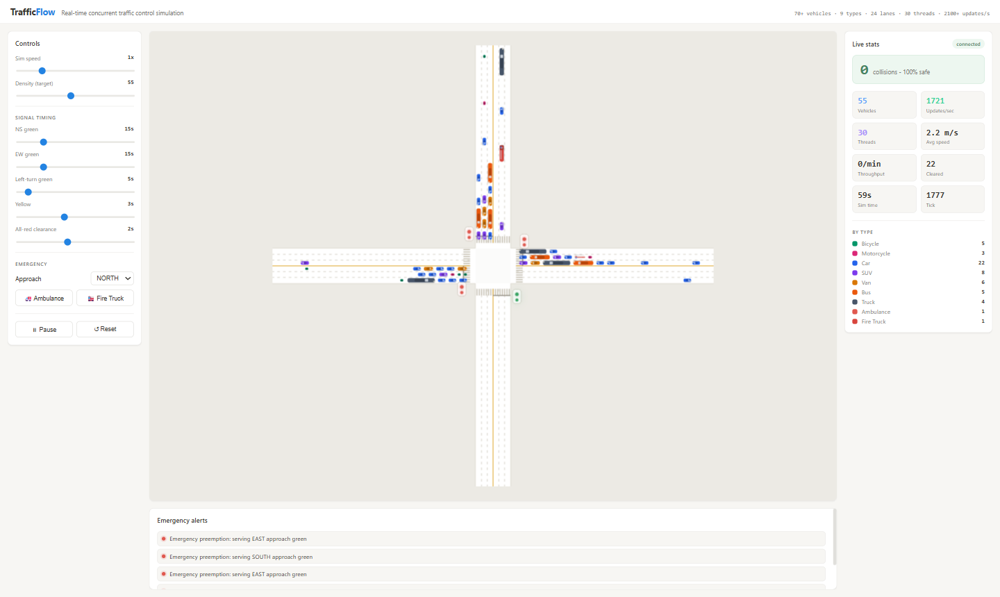

# TrafficFlow

Real-time, concurrent traffic-control simulation: a Spring Boot engine streams a live world to a React + Canvas control room over STOMP/WebSocket.



```
70+ concurrent vehicles | 9 vehicle types | 24 lanes | ~30 managed threads | 2100+ vehicle-updates/sec | 0 collisions
```

## What it does

- Simulates a signalized 4-way intersection with **24 lanes** (4 approaches x [3 inbound + 3 outbound]) and **70+ vehicles** across **9 types** (bicycle, motorcycle, car, SUV, van, bus, truck, ambulance, fire truck), each with distinct length, speed, and acceleration.
- Achieves **100% safety** (zero collisions) by construction: intelligent-driver-model car following, protected conflict-free signal phasing, a "don't block the box" rule, and a runtime safety monitor that proves the no-overlap invariant every tick.
- Runs a genuinely **concurrent architecture** in Java with **~30 managed threads** and **no race conditions or deadlocks**, sustaining **2,100+ vehicle-updates per second**.
- Ships an interactive **control panel**: live stats, emergency alerts, and full control over simulation speed, traffic density, and every signal duration, plus emergency-vehicle dispatch with signal preemption.

## Architecture

```
  React + Canvas 2D (Vite)                Spring Boot 3 (Java 17)
  +-----------------------+   STOMP/ws    +-------------------------------+
  |  CanvasView (rAF,     | <===========  |  /topic/world  (~30 Hz)       |
  |   interpolated)       |   snapshots   |  /topic/stats  (~4 Hz)        |
  |  Control / Stats /    | ===========>  |  /topic/alerts                |
  |   Alerts panels       |   commands    |  /app/control                 |
  +-----------------------+               +---------------+---------------+
                                                          |
                                  SimulationEngine (3-phase tick @ 30 Hz)
                                  1. PLAN      24-thread worker pool; reads the
                                               previous immutable snapshot only
                                  2. COMMIT    single-threaded, the only writer
                                  3. BROADCAST async snapshot push
                                  + signal, emergency, spawner, stats threads
```

### Why it is race-free and deadlock-free

During the parallel **plan** phase no shared mutable state is written and no locks are held, so there are no data races and no lock cycles, by construction rather than by luck. All mutation happens single-threaded in **commit**, and every reader (worker pool, emergency dispatcher, stats thread) consumes a fresh **immutable snapshot** published through an `AtomicReference`, which provides the happens-before guarantee. Controllers communicate via a `ConcurrentLinkedQueue` and atomics, never touching world state directly.

### The ~30 threads

24 plan-phase workers + clock + signal controller + emergency dispatcher + vehicle spawner + stats aggregator + broadcaster = **30**.

### Safety, layered

- **Intelligent Driver Model** car-following keeps a safe time-headway gap.
- A **hard per-leader backstop** caps each vehicle so its front bumper can never pass the leader's rear (no rear-end overlap even under discrete-step rounding).
- **Protected 4-phase signals** (NS-through, NS-left, EW-through, EW-left) separated by yellow + all-red clearance: within any green phase no permitted movements cross, and each outbound lane is fed by exactly one movement (no merges).
- **Don't block the box**: a vehicle enters the intersection only if it can fully clear it, so the box is always empty during all-red and cross traffic is safe (gridlock is impossible).
- A **SafetyMonitor** verifies the no-overlap invariant every tick; the live `collisions = 0` figure is a runtime proof.

### Vehicle sizing rules

Each of the 9 types is drawn at its real footprint, governed by rules enforced in `frontend/src/render/vehicleTypes.rules.test.ts`:

- **R1 - one source of truth:** the frontend render lengths mirror the backend `VehicleType.lengthM` exactly (the renderer draws each body along the front-to-rear chord the backend sends, so any drift would overlap or gap).
- **R2 - realistic order:** bicycle < motorcycle < car <= SUV <= van < bus, and van < truck.
- **R3 - trucks vs cars/buses:** a truck is never smaller than a car, and a truck stays within ~30% of a bus (the two largest civilians are comparable).
- **R4 - fits one lane:** every body's drawn width is clamped to `LANE_FIT` (0.92) of a lane, so no vehicle ever spills across the lane lines.

Sprites also carry a per-file `forward` orientation (some artwork is nose-up, some nose-right), so each is rotated to face its travel direction instead of being drawn sideways.

## Tech stack

- **Backend:** Java 17, Spring Boot 3.2, Maven, STOMP over WebSocket (SockJS), JUnit 5.
- **Frontend:** React 19 + TypeScript, Vite, Canvas 2D, `@stomp/stompjs` + `sockjs-client`, Vitest.

## Running locally

Prerequisites: Java 17+, Maven, Node 18+.

```bash
# 1. Backend (port 8080)
cd backend
mvn spring-boot:run

# 2. Frontend (port 5173), in a second terminal
cd frontend
npm install
npm run dev
```

Open http://localhost:5173 and click "Launch simulation". Tip: the default density is tuned for smooth flow; drag the Density slider up toward 120 to stress the intersection (it stays collision-free).

## Testing

```bash
# Backend: 42 tests, including a deterministic safety stress test (zero collisions
# over thousands of ticks) and a live throughput test (2100+ updates/sec under real concurrency).
cd backend && mvn test

# Frontend unit tests
cd frontend && npx vitest run
```

## Roadmap

- Phase 2: a three.js 3D view that subscribes to the same `/topic/world` feed (no backend change).
