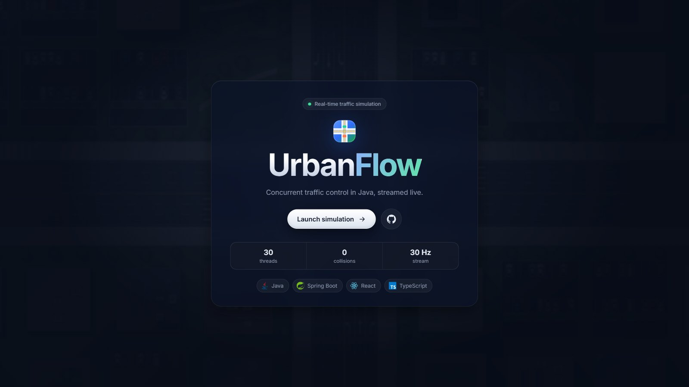
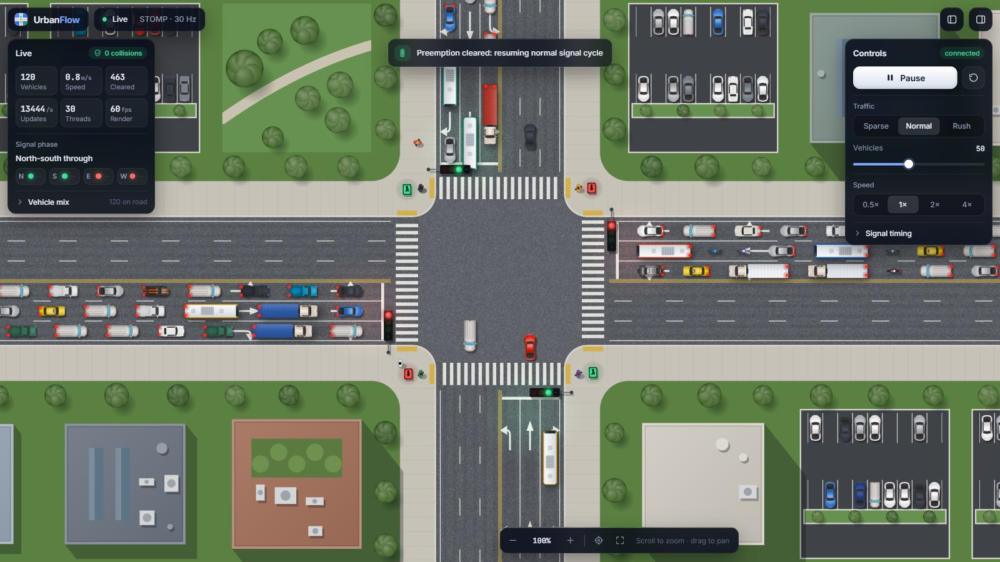
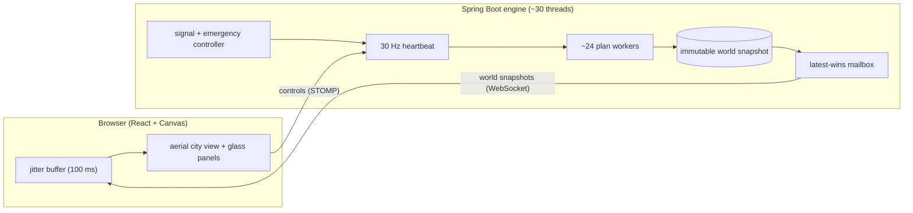
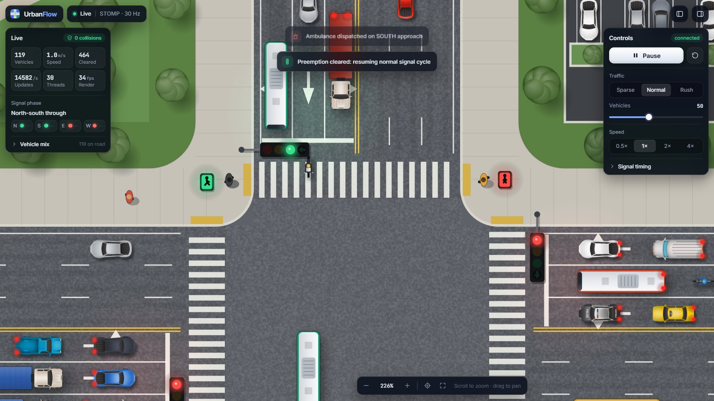
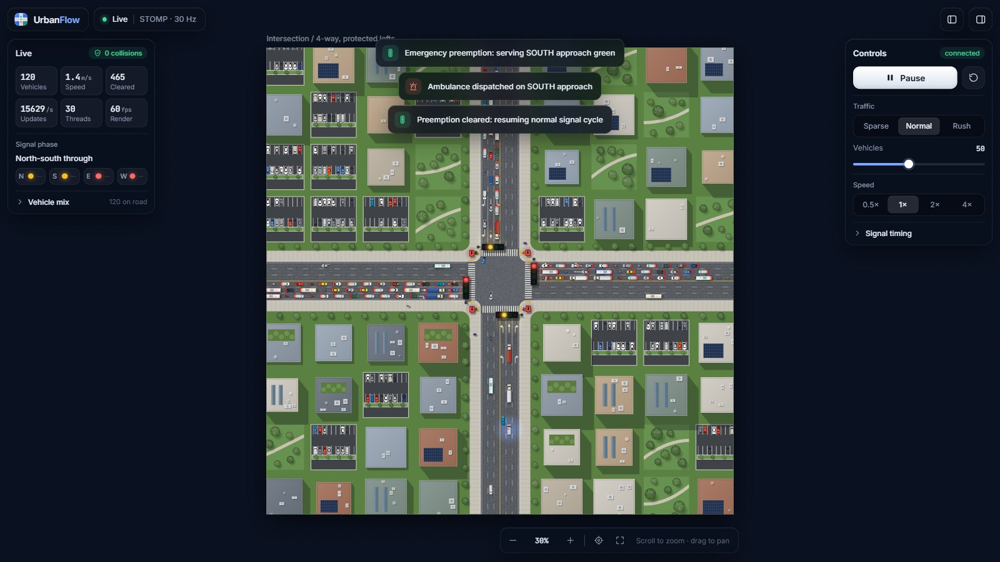

<div align="center">



<h1>UrbanFlow</h1>

<b>120 vehicles through one intersection, in real time, with zero collisions.</b><br>
A concurrent traffic-control engine in Java, streamed live to a React + Canvas city in the browser.

<br><br>

<a href="https://urbanflow-lyart-two.vercel.app"><b>Live demo</b></a>
<br><sub>The backend runs on Render's free tier, so the first visit after a quiet spell can take about a minute to wake up.</sub>

<br><br>


</div>

<p align="center">
  
</p>

## What it is

UrbanFlow is a real-time simulation of a busy signalized intersection. Every vehicle on screen is an independent agent making its own decisions many times a second. A Java engine runs the whole world across roughly thirty threads and streams it to the browser over WebSocket. The browser draws it as an aerial view of a city block, on a pan-and-zoom canvas with floating glass panels. Up to **120 vehicles** (cars, buses, trucks, bikes, plus ambulances and fire engines that show up at random) move through the crossing at the same time, and a runtime checker proves they never collide.

I built it to learn real-time concurrent systems by watching them work, not by reading about them.

## What this project demonstrates

If you are skimming, here is the engineering on display:

- **Concurrency without locks.** Around thirty threads read the same world at once with no contention, because they all read from one immutable snapshot while a single writer prepares the next one. No shared mutable state, no deadlocks, no torn reads.
- **Backpressure that cannot pile up.** World frames go to the network through a one-slot, latest-wins mailbox. A slow socket skips stale frames instead of queueing them, so viewer latency stays bounded no matter how slow the connection gets.
- **Smooth motion over a jittery network.** The browser keeps a short jitter buffer keyed on the engine's own clock and plays it back 100 ms behind the newest frame. Frames that land early or late change how much is buffered, never what is drawn.
- **Correctness under load.** Safety is enforced by construction (following gaps, signal phasing, "don't block the box", emergency preemption) and verified by an invariant checker that runs every tick. The result holds at full density: zero collisions.
- **Rendering that holds 60 fps.** The static city is cached offscreen and only redrawn when the camera zooms. Vehicles are mipmapped sprites, and every light glow is a pre-rendered sprite instead of a per-frame blur. Measured in Playwright: p99 frame time 17.3 ms, no dropped frames.

## Run it locally

You need **Java 17**, **Maven**, and **Node 18+**. Open two terminals.

**1. Backend** (the Java simulation engine, serves a WebSocket on port 8080):

```bash
cd backend
mvn spring-boot:run
```

**2. Frontend** (React + Canvas, talks to the backend over WebSocket):

```bash
cd frontend
npm install
npm run dev
```

Open the URL Vite prints (usually `http://localhost:5173`) and press **Launch simulation**. Start the backend first, then the frontend.

Using the view:

- Scroll to zoom around the cursor, drag to pan, and double-click to jump back to the intersection. The bar at the bottom has zoom in and out, recenter and fit-the-whole-map.
- The **Controls** panel on the right pauses and resets the engine, switches traffic between Sparse, Normal and Rush, sets the vehicle count (up to 120) and the speed, and retimes every signal phase.
- The **Live** panel on the left shows the collision count, throughput, engine update rate, the current signal phase for each approach, and the vehicle mix.
- Both panels resize: drag an inner edge, the bottom edge or the corner. Double-click a handle to reset it.

## The hard part: a hundred cars all thinking at once

The whole point was traffic where every car thinks for itself, all together, all the time. That sounds simple until you try it: when a hundred little "minds" reach for the same shared world at the same instant, the data normally corrupts or the program freezes.

The idea that made it click was surprisingly calm:

> Everyone reads from the same frozen **photo** of the world. Then a single referee writes the **next** photo. Nobody ever scribbles on the same page at the same time.

So roughly thirty workers can all look at the road at once (a photo can't change while you read it), and only one of them is ever allowed to paint the next moment. With that one rule in place, the simulation never trips over itself and never locks up. The fix for chaos was not more locks and guards. It was giving everyone something that cannot change underneath them.

## How it fits together


```mermaid
flowchart LR
    subgraph Browser["Browser (React + Canvas)"]
        Buf["jitter buffer (100 ms)"]
        UI["aerial city view + glass panels"]
        Buf --> UI
    end
    subgraph Engine["Spring Boot engine (~30 threads)"]
        Loop["30 Hz heartbeat"]
        Workers["~24 plan workers"]
        Snap[("immutable world snapshot")]
        Signals["signal + emergency controller"]
        Box["latest-wins mailbox"]
    end
    UI -- "controls (STOMP)" --> Loop
    Loop --> Workers --> Snap
    Signals --> Loop
    Snap --> Box
    Box -- "world snapshots (WebSocket)" --> Buf
```

- **The shared photo.** One snapshot of the world that everybody reads from, swapped out all at once. This is what keeps the crowd of workers from fighting.
- **The command mailbox.** When you drag a slider, it doesn't reach into the engine. It drops a note in a box, and the engine reads its mail when it is ready.
- **The outbound mailbox.** It holds exactly one frame. If the network is still busy with the last frame, the new one simply replaces the waiting one, so nothing ever backs up.
- **The heartbeat.** The world ticks about thirty times a second, like a game loop. The browser's jitter buffer then plays those ticks back at the screen's own frame rate.

## Zero collisions, by construction

To get to zero crashes, the vehicles follow the same etiquette we all learned for the road, written down as code:

- **Keep your distance.** Every vehicle watches the one ahead and leaves a real gap, easing off the gas as it closes in.
- **Green means the whole path is yours.** The lights are timed so streams that get a green never cross. Left turns get their own protected phase, with a yellow and an all-red pause between phases.
- **Never block the box.** A vehicle only enters the middle if it can make it all the way out, which makes gridlock impossible.
- **A red light is a wall.** Vehicles stop cleanly at the line and wait their turn.
- **Make way for sirens.** Ambulances and fire engines are dispatched at random. As one approaches, the lights pre-empt in its favour and a path is cleared through any jam in front of it.
- **People go first.** Pedestrians are simulated in the engine too. They cross only on their WALK phase, into a clean gap, with enough green left to finish. While anyone is on a crosswalk, every vehicle whose route sweeps it holds at the stop line.

A watcher checks the whole road on every heartbeat and confirms no two vehicles ever overlap, and that no vehicle ever touches a walker on the carriageway. The zero you see on screen is not a hope. It is verified thousands of times a second.

## Proving it under load (k6)

Claims are cheap, so there is a [k6](https://k6.io) load test that swarms the engine the same way real browsers would. Each virtual user opens a WebSocket, does the STOMP handshake, and subscribes to the world and stats streams. Before the swarm arrives, the script plays operator and pushes density to the full 120 vehicles, so the engine is tested at peak.

```bash
# terminal 1: start the backend
cd backend && mvn spring-boot:run

# terminal 2: unleash 50 concurrent spectators for ~60s
k6 run loadtest/k6-stomp-load.js

# or crank it up
k6 run -e VUS=100 -e SESSION_SECONDS=90 loadtest/k6-stomp-load.js
```

The test fails unless all of this holds:

- every VU completes the STOMP handshake
- the 30 Hz world stream never stutters (p95 gap between frames < 150 ms)
- the engine reports **zero collisions** for the whole run
- the operator's density command actually takes effect (100+ live vehicles)

A run on a laptop, 50 VUs for 60 seconds at full 120-vehicle density: ~1,600 messages/s fanned out (15 MB/s), median frame gap 32 ms against a 33 ms target, the engine sustaining ~3,400-3,900 vehicle-updates/s, and 0 collisions across the entire test.

<p align="center">
  
</p>

## A living city

Nine kinds of vehicle, from a bicycle up to a fire engine, each with its own size and feel. A bus is heavy and slow off the line, a motorbike is nimble, and nothing ever spills over its lane lines. Cars, SUVs, vans, the ambulance and the truck cab are real top-down sprites, recoloured pixel by pixel into a realistic mix of white, black, silver, blue and red traffic. The bus, the trailer, the fire engine and the riders are drawn in the same style. When a vehicle slows, its brake lights glow, so a queue at a red reads as waiting rather than frozen. Emergency vehicles wash the asphalt around them in red and blue.

The map is laid out like an aerial photo, lit from the north-west. The asphalt has grain and polished wheel tracks, the lanes carry painted turn arrows, the kerbs curve round the corners with tactile paving at every crosswalk, and the blocks around the junction are a mix of rooftops, parking lots with parked cars, and small parks. Zoom all the way out and the map sits as a frame on a dotted canvas, the way a design file does.

<p align="center">
  
</p>

The people are not decoration. Pedestrians are simulated in the backend engine on the same clock as the vehicles and streamed in every snapshot. They stroll the footpaths, wait at the kerb for their WALK phase, hurry across the carriageway, and leave at their destination. Vehicles yield to them at the stop line, and the same safety monitor that proves vehicles never crash also proves no vehicle ever touches a walker.

## Deployment

The backend runs on Render as a Docker web service (a persistent JVM that can hold WebSockets open). The frontend is a static Vite build on Vercel, pointed at the backend with `VITE_WS_URL` at build time. [DEPLOYMENT.md](DEPLOYMENT.md) covers why the split is forced and how to set it up.

## Tech stack

| Layer | What it uses |
|------|---------------|
| Engine | Java 17, Spring Boot 3.2, a fixed-rate scheduler, an immutable snapshot model, a lock-free latest-wins broadcast mailbox |
| Transport | STOMP over WebSocket (SockJS fallback) |
| Frontend | React 19, TypeScript, Vite, Canvas 2D (cached static layer, mipmapped sprites, jitter-buffered playback) |
| Hosting | Render (backend), Vercel (frontend) |
| Tooling | Maven, npm, Vitest, k6 (WebSocket load testing), Playwright (render checks) |

## Credits

Vehicle sprites from the [Top-down vehicle sprites pack](https://opengameart.org/content/free-top-down-car-sprites-by-unlucky-studio) by Unlucky Studio, released under CC0.

<div align="center">
<br>
Built for the love of watching systems work.<br>
<sub>Java for the brain, React + Canvas for the window, streamed live over WebSocket.</sub>
</div>
